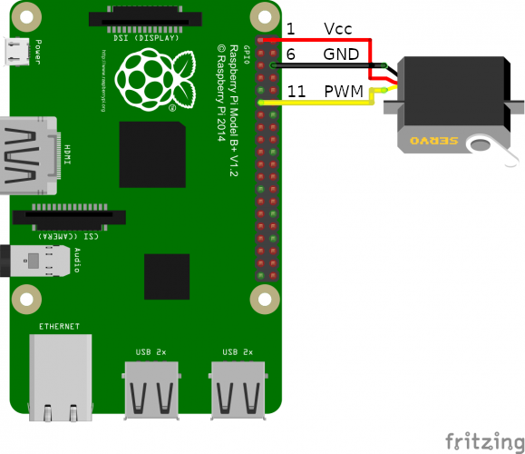

# GatePass

Raspberry Pi Telegram Remote Control Bot

Update: https://www.w3schools.com/nodejs/nodejs_raspberrypi_blinking_led.asp

## Prerequisites

### Hardware



### Software

#### Node.js

```bash
sudo apt update
sudo apt upgrade
sudo apt install npm
```

#### Pi Blaster
Follow [Pi Blaster library](https://github.com/sarfata/pi-blaster) setup. Patch file `pi-blaster.c` before compile to set 50Hz servo frequency:

```c
#define CYCLE_TIME_US 20000
```

## Installation

```bash
cp .env.example .env
```

Replace placeholders in `.env` with actual API key

```bash
npm install
npm start
```

## Systemd Service

```bash
sudo nano /etc/systemd/system/gatepass.service
```

```bash
[Unit]
Description=GatePass
After=network.target

[Service]
WorkingDirectory=/home/pi/projects/gatepass
ExecStart=/usr/bin/npm start
Restart=on-failure
User=pi

[Install]
WantedBy=multi-user.target
```

### Start and Enable

```bash
sudo service gatepass start
sudo systemctl enable gatepass.service
```

### Status
```bash
sudo service gatepass status
● gatepass.service - GatePass
   Loaded: loaded (/etc/systemd/system/gatepass.service; disabled; vendor preset: enabled)
   Active: active (running) since Tue 2019-07-02 20:03:46 UTC; 1s ago
 Main PID: 3345 (node)
    Tasks: 6 (limit: 2200)
   Memory: 5.2M
   CGroup: /system.slice/gatepass.service
           └─3345 node /usr/bin/npm start
```

## References

* [Raspberry Pi Servo Motor control](https://tutorials-raspberrypi.com/raspberry-pi-servo-motor-control/)
* [Systemd Service in Node.js on Raspberry Pi](https://medium.com/@simon_prickett/writing-a-systemd-service-in-node-js-on-raspberry-pi-be88d9bc2e8d)
